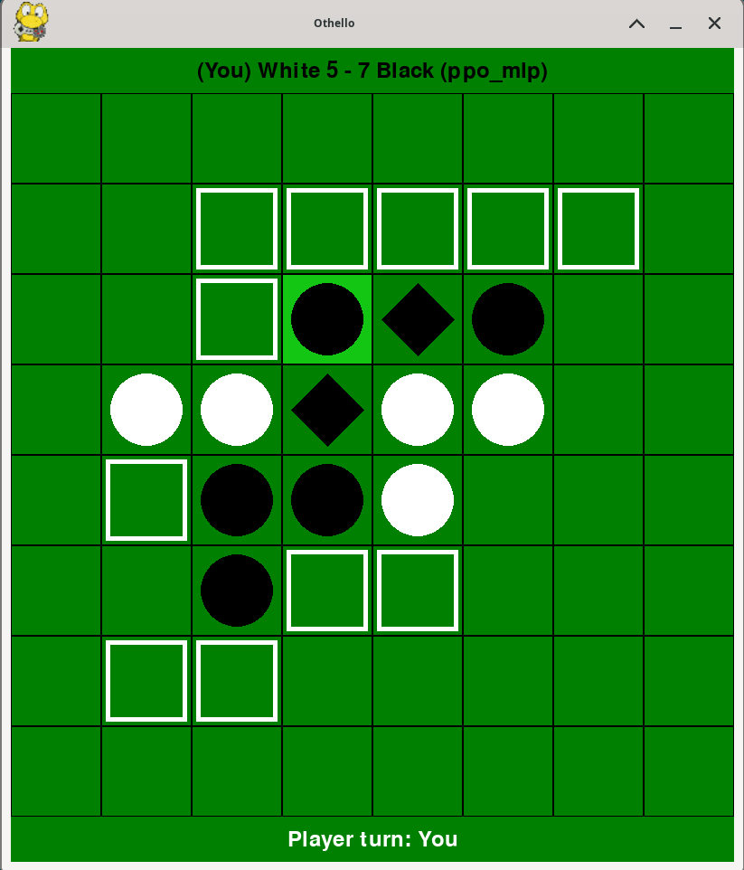

# Reversi AI Project

## Description

This project involves developing an AI models for playing Reversi (also known as Othello). The goal was to create and train various AI models.
After training the models, they were benchmarked, and an Elo ranking system was used to evaluate their performance.

## Getting Started

### Prerequisites

Before running the project, ensure you have the following installed:

- Python 3.11.2, (3.8< version <3.12)
- Required Python packages (pip install -r requirements.txt):
  - stable-baselines3
  - sb3-contrib
  - numba
  - numpy
  - torch
  - pygame
  - tqdm 
- download and unzip models folder and put it in reversi-game/reversi-game folder - [Link to g drive](https://drive.google.com/drive/folders/14qqvrT65f06vb5iivH9EdJtylYMtIpWh?usp=sharing)

## Output

Details about experiments and model training - [Link to g drive](https://drive.google.com/drive/folders/1mUdSOnpk9KpQX28UFCfgCT2DFelAGUTw?usp=drive_link)

## Demo

Inside the demo folder, you can find scripts for:
  - Running an Elo ranking tournament
  - Benchmarking two agents for X matches
  - Playing against an agent with a GUI, or watching two agents play against each other
   

## Benchmarking Results - Elo Ranking After 100 Rounds

In this project, various AI models for the Reversi game were evaluated and ranked based on their Elo ratings after 100 rounds of every model playing against every other both as first and second starting player. Below is a description of each model:

- **Alpha-MCTS - Depth 200:** An AlphaZero-style model utilizing Monte Carlo Tree Search (MCTS) with a search depth of 200. This model uses nn that was trained on data generated by self-play.

- **Alpha-MCTS - Depth 30:** An AlphaZero-style model using MCTS with a search depth of 30.

- **PPO-MLP:** A reinforcement learning model that uses Proximal Policy Optimization (PPO) with a Multi-Layer Perceptron (MLP) as its policy network.

- **MCTS Iteration Limit 500:** A model using Monte Carlo Tree Search (random simulations) with a limit of 500 iterations to explore possible game states.

- **PPO-CNN:** A PPO model with a Convolutional Neural Network (CNN) policy.

- **MCTS Iteration Limit 200:** A model using MCTS with a limit of 200 iterations.

- **MinMax (depth 1 / dynamic) with Human Set Heuristics:** A MinMax algorithm enhanced with heuristics manually set by a human for improved performance.

- **MinMax (depth 1 / dynamic) GA:** A MinMax algorithm optimized using a genetic algorithm (GA) to determine the best parameters.

- **MCTS Iteration Limit 30:** A model using MCTS with a limit of 30 iterations.

- **ARS (Augmented Random Search):** A reinforcement learning algorithm utilizing augmented random search techniques.

- **TRPO-CNN (Trust Region Policy Optimization):** A TRPO model using a CNN policy.

- **Random Model:** A baseline model that makes random moves.

Below is the table showing the results:

| Agent                          | Score    |
|--------------------------------|----------|
| alpha-mcts - depth 200         | 1910.32  |
| alpha-mcts - depth 30          | 1651.31  |
| ppo_mlp                        | 1383.41  |
| Mcts iter_limit 500            | 1286.51  |
| ppo_cnn                        | 1283.64  |
| MinMax minmax human depth dyn  | 1229.74  |
| Mcts iter_limit 200            | 1210.36  |
| MinMax minmax GA depth dyn     | 1177.19  |
| MinMax minmax GA depth 1       | 1050.34  |
| trpo_cnn                       | 1001.35  |
| Mcts iter_limit 30             | 988.64   |
| ars                            | 984.94   |
| MinMax minmax human - depth 1  | 963.82   |
| Random model                   | 611.16   |

